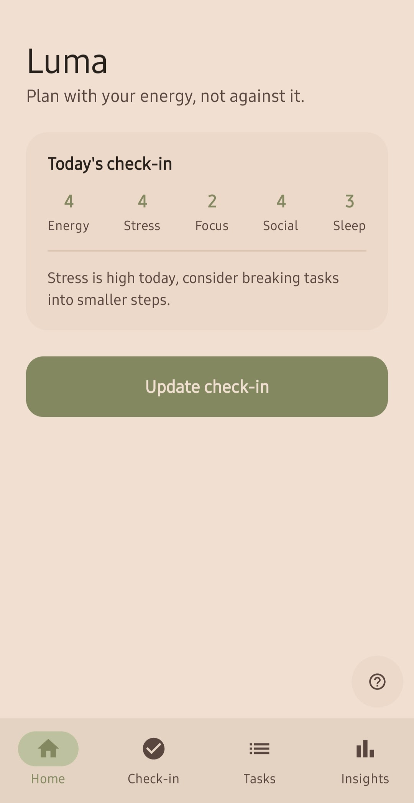
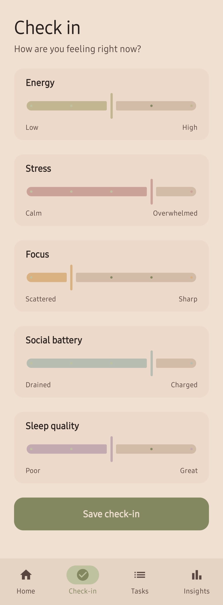
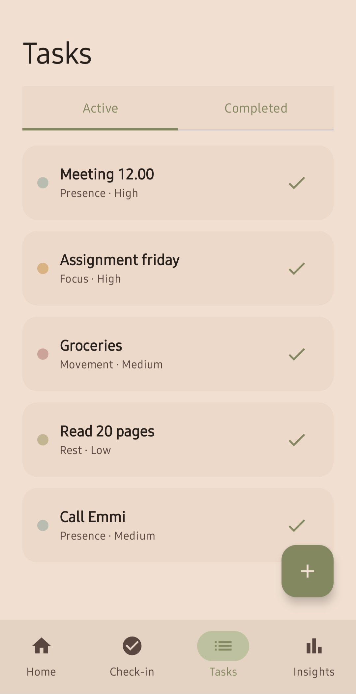
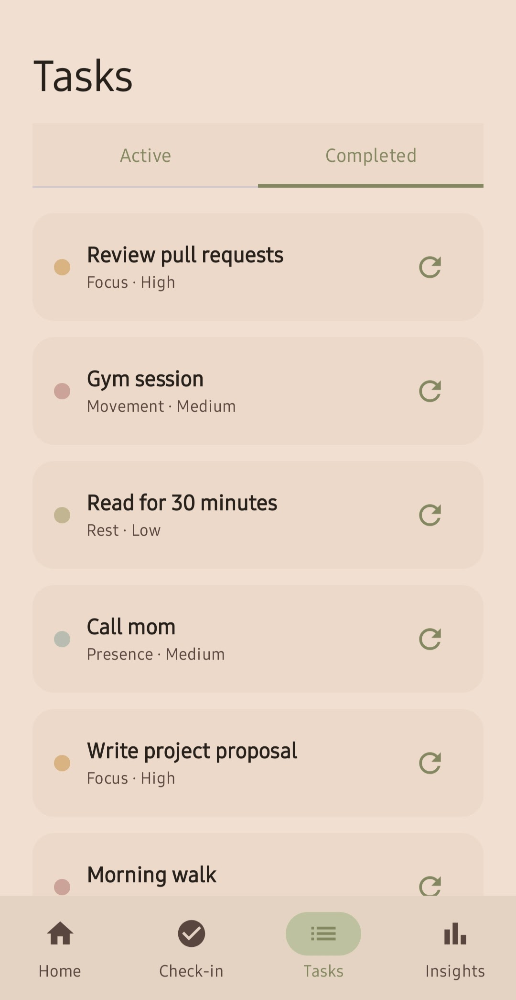
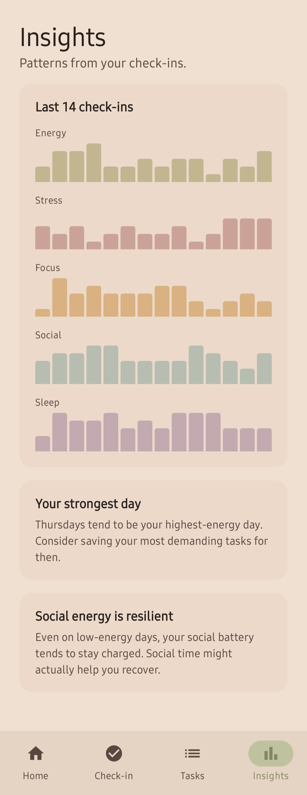

# Luma

Luma is an Android app for energy-aware planning. Instead of treating every task the same, Luma asks you how you're feeling first, then helps you plan around that, not against it.

## Why

Most to-do apps assume you have the same amount of energy every day. In reality, focus, stress, and motivation fluctuate, and pushing through regardless often leads to burnout or a guilty, half-finished list. Luma starts from how you actually feel: a quick daily check-in, then tasks tagged by the kind of energy they require, so you can match what you do with what you have.

The app is built calm and non-judgmental by design. No streaks, no guilt-tripping notifications, no emojis demanding your attention. Just a simple way to notice your energy and plan accordingly.

## Features

- **Daily check-in**: rate your energy, stress, focus, social battery, and sleep quality on a simple 1-5 scale
- **Energy-tagged tasks**: every task is labeled as Rest, Focus, Presence, or Movement, so you know what it asks of you
- **Home overview**: see today's check-in summary and a gentle suggestion based on how you're doing
- **Insights**: track patterns in your energy over time
- **First-time onboarding**: a short walkthrough explaining the concept, shown once and available again anytime via the help icon on Home

## Screenshots

| Home                      | Check-in                     | Tasks                                                                | Insights                      |
|---------------------------|------------------------------|----------------------------------------------------------------------|-------------------------------|
|  |  |   |  |

## Tech stack

- **Kotlin** with **Jetpack Compose** for UI
- **MVVM** architecture
- **Room** for local persistence (check-ins and tasks)
- **DataStore** for lightweight preferences (onboarding state)
- **Navigation Compose** for screen navigation
- Material 3 design system with a custom calm, sand-and-sage color palette

## Project structure

```
app/src/main/java/com/example/luma/
├── data/
│   ├── model/          # Room entities (CheckIn, Task) and enums
│   ├── database/        # Room database setup
│   └── repository/      # Data access layer
├── ui/
│   ├── home/             # Home screen and view model
│   ├── checkin/          # Check-in flow
│   ├── tasks/            # Task list and add/edit task
│   ├── insights/         # Energy pattern insights
│   ├── onboarding/        # First-time onboarding flow
│   └── theme/            # Colors, typography, theme
├── Navigation.kt          # App navigation graph
└── LumaApplication.kt     # App entry point, database seeding
```

## Running the app

1. Clone the repository
2. Open the project in [Android Studio](https://developer.android.com/studio) (Hedgehog or newer recommended)
3. Let Gradle sync and download dependencies
4. Run the app on an emulator or physical device (minimum SDK 26 / Android 8.0)

No backend or API keys are required. The app seeds itself with sample data on first launch so there's something to look at right away.

## Status

This is a portfolio/learning project and a work in progress. The focus has been on the core flow: check-in, task management, and onboarding. 
Planned next steps include richer insights and refining the suggestion logic.